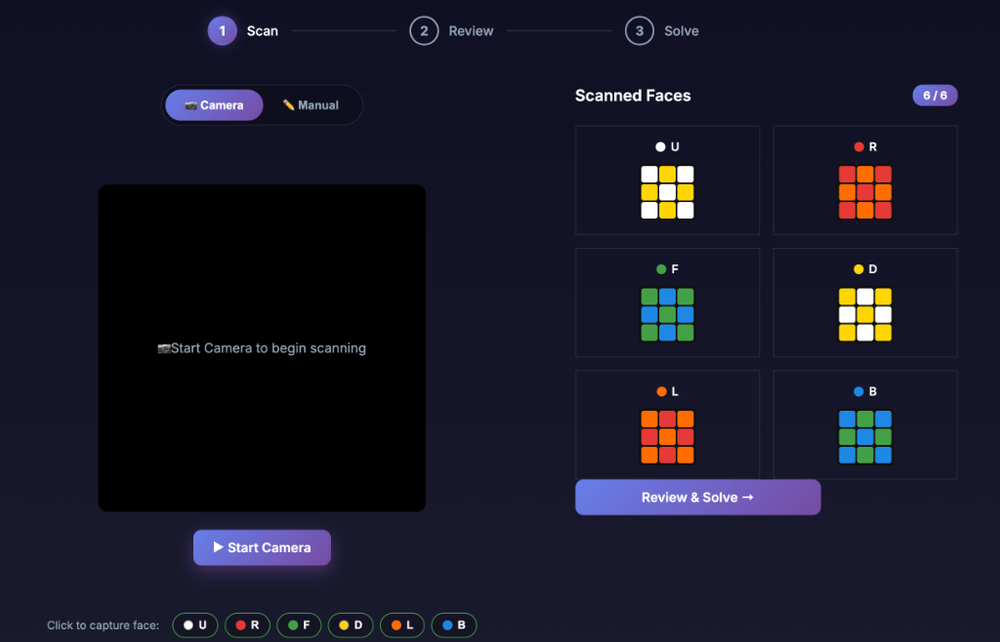
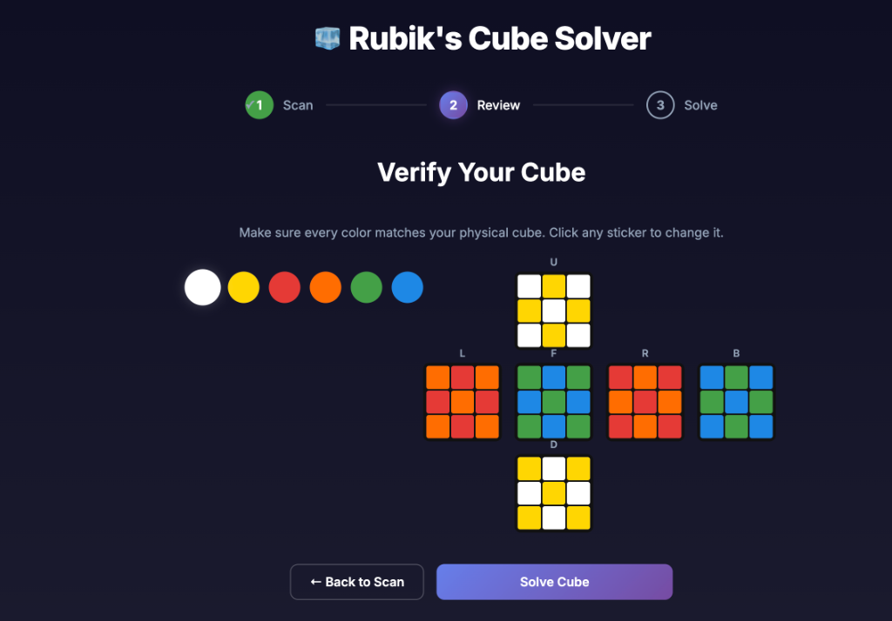
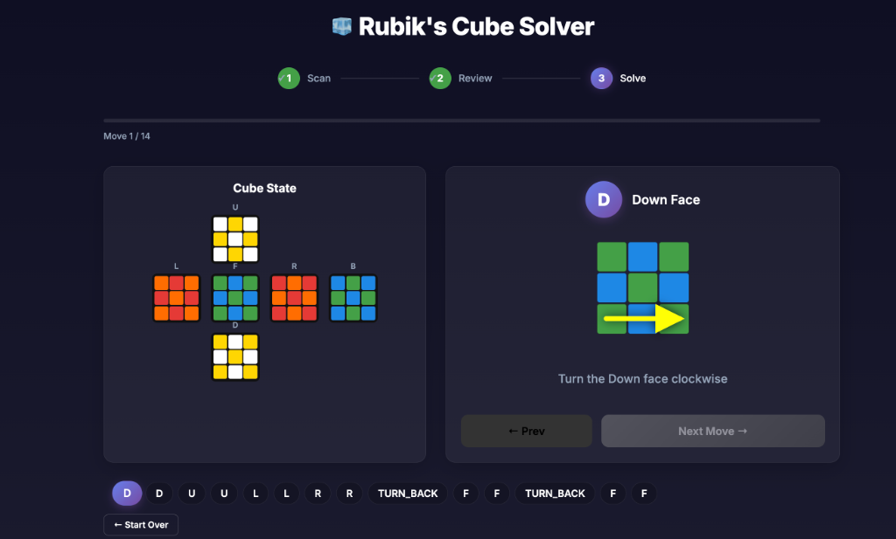

# Rubik's Cube Solver (Hybrid Web + C++)

A high-performance Rubik's Cube solver utilizing a **Python/Flask Web Interface** for OpenCV camera scanning and a blazing fast **C++17 Engine** for calculating the solution from scratch.

---

## Key Features

- **Hybrid Architecture**: Beautiful web interface combining HTML/JS with a Python Flask backend, while delegating heavy algorithmic lifting to a custom C++ subprocess.
- **From-Scratch Kociemba Solver (C++)**:
  - Custom implementation of Kociemba's Two-Phase algorithm in C++.
  - In-memory Phase 1 & Phase 2 pruning table generation via BFS on startup in under **0.3 seconds**.
  - Iterative Deepening A* (IDA*) search for optimal moves.
- **Web-based OpenCV Vision**:
  - Python OpenCV processes webcam feeds in the browser.
  - Live grid rendering and HSV color classification (White, Yellow, Red, Orange, Green, Blue).
- **Interactive Playback**:
  - Step-by-step 2D visualizer that dynamically generates precise SVG arrows showing exactly which slice to turn.
  - Interactive "Next" and "Prev" controls with complete state history to guide you through the optimal solution without confusion.

---

## Project Structure

```
RubiksCV/
├── app.py                  # Python Flask web server & OpenCV processor
├── requirements.txt        # Python dependencies
├── start.sh                # Helper script to create venv and run the server
├── Makefile                # C++ compilation configuration
├── static/                 # Web interface (HTML, JS, CSS)
├── Resources/              # Visual assets for arrow overlays
└── src/
    ├── cli_solver.cpp      # C++ CLI wrapper exposing the solver to Python
    ├── solver.cpp          # Kociemba algorithm & coordinate mapping implementation
    └── solver.h            # Header file exposing the solver interface
```

---

## Installation & Setup

### 1. Compile the C++ Solver (macOS)
Ensure you have Xcode Command Line Tools installed (`xcode-select --install`).

Compile the C++ CLI executable:
```bash
make clean && make
```
This generates the `rubiks_solver_cli` binary that the web server will call.

### 2. Setup Python Environment
Ensure Python 3 is installed.

```bash
# Create a virtual environment and activate it
python3 -m venv venv
source venv/bin/activate

# Install dependencies
pip install -r requirements.txt
```

---

## Screenshots

### 1. Scan (Camera or Manual)
Capture all 6 faces of the Rubik's Cube using your webcam or click to input manually.


### 2. Review
Verify the captured colors against your physical cube.


### 3. Solve
Follow the dynamically generated SVG arrows perfectly mapped to each face slice.


---

## How to Run & Use

Start the Flask web server:
```bash
./start.sh
```
*(Or manually via `python app.py`)*

### Using the App
1. Open your browser to `http://localhost:5001`.
2. **Scan Phase**: Click **▶ Start Camera** to use your webcam, or switch to **Manual Mode** to click the grid and fill colors by hand.
3. Once all 6 faces are captured successfully, click **Solve Cube**.
4. **Review Phase**: Verify the colors. The backend instantly calculates the most optimal path using the C++ Two-Phase algorithm!
5. **Solve Phase**: Follow the beautiful dynamic SVG arrows to solve your cube step-by-step. Use the **Prev** and **Next Move** buttons to navigate through the history easily!
